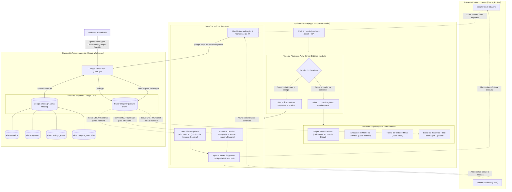

# Especificação Técnica e Arquitetural — PythonLab (Apps Script + Sheets + Drive)

> [!IMPORTANT]
> ### PREMISSAS ARQUITETURAIS & FILOSOFIA PEDAGÓGICA
> 1. **Zero Execução de Código Python no Sistema**: A plataforma é **100% informativa, rica em modelos visuais conceituais e interativa**. A prática real de código ocorre no **Google Colab** ou **Jupyter Notebook**.
> 2. **Onde Estão as Orientações Pedagógicas para as Aulas**: As orientações completas, diretrizes curriculares, enunciados, gabaritos e planejamentos de cada aula **residem estritamente dentro da pasta `aulas/`, em formato Markdown (`.md`)** (ex.: `aulas/aula1_2.md`, `aulas/aula1_3.md`, etc.). O arquivo `.md` é a **fonte primária e oficial da verdade** para a implementação dos componentes modulares `AulaX_Y.html` da aplicação.
> 3. **Bifurcação Didática Imediata no Topo da Aula (Fast-Track vs. Deep-Dive)**: Logo no cabeçalho inicial de cada aula, o aluno visualiza uma divisão clara entre **"Explicações & Fundamentos"** e **"Exercícios Propostos & Prática"**. O aluno decide de imediato se precisa consolidar a teoria (simulação passo a passo, memória Stack x Heap, trace tables e exercício resolvido) ou se prefere saltar diretamente para os desafios práticos no Colab/Jupyter.
> 4. **Suporte a Imagens Didáticas Opcionais do Professor em Cada Questão**: Toda e qualquer questão da plataforma (exercícios resolvidos de exemplo, atividades práticas propostas em cada bloco temático ou desafios integradores) possui suporte nativo para o professor anexar uma imagem explicativa (diagramas conceituais, anotações de lousa, esquemas mentais, ilustrações de apoio, tabelas I/O ou mapas de fluxo). O anexo de imagem é **estritamente opcional**: se o professor não cadastrar imagem, o aluno/visitante visualiza a questão com diagramação limpa sem espaços vazios. Essas imagens são salvas automaticamente em uma pasta do Google Drive denominada **`imagens`**, localizada exatamente no mesmo diretório pai que contém a planilha-mestre do projeto, com metadados persistidos na aba **`Imagens_Exercicios`**.
> 5. **Autorresponsabilidade na Gestão da Aprendizagem**: Não existe juiz automático punitivo ou bloqueio artificial. O **próprio aluno é o responsável por sinalizar sua evolução**, com dois propósitos fundamentais:
>    - **Saber onde parou e dar prosseguimento**: Retomar os estudos com 1 clique exatamente do tópico onde interrompeu sua sessão anterior;
>    - **Identificar no que precisa tirar dúvidas com o professor**: Sinalizar conceitos ou exercícios difíceis, registrar perguntas no "Caderno de Dúvidas" e chegar à aula/monitoria com foco cirúrgico no que precisa destravar.
> 6. **Ponte Didática para o Colab/Jupyter**: Códigos iniciais copiáveis com 1 clique, especificações detalhadas de I/O (entradas vs saídas esperadas), gabaritos comentados para comparação e autoavaliação formativa.

---

## 1. Visão Geral do Projeto

O **PythonLab** é uma plataforma educacional interativa construída sobre o ecossistema do **Google Workspace** (Google Apps Script + Google Sheets + Google Drive), com custo zero de infraestrutura e sem necessidade de servidores dedicados de backend.

O foco didático central é transformar o aprendizado de algoritmos em uma experiência visual intuitiva, revelando a "caixa-preta" de CPython:
- O que ocorre na **Call Stack** (frames locais e identificadores de variáveis);
- Como funciona o **Heap Space** (alocação de objetos, imutabilidade de tipos primitivos e ponteiros);
- Como rastrear iterações e condições através de **Tabelas de Teste de Mesa (Trace Tables)**;
- Prática assistida que incentiva o aluno a codificar em ferramentas profissionais de ciência de dados (**Jupyter Notebook** e **Google Colab**);
- Enriquecimento visual com **imagens didáticas opcionais anexadas pelos educadores em qualquer questão da trilha** e **navegação bifurcada no início de cada aula** para respeito ao ritmo individual de cada aprendiz.

---

## 2. Arquitetura do Sistema e Fluxo de Trabalho



---

## 3. Arquitetura Híbrida: Flexibilidade para Novas Aulas

Para permitir que o catálogo de aulas evolua continuamente de forma modular, padronizada e sem necessidade de alterar o roteador central:

1. **Repositório de Especificações Didáticas (`/aulas`)**:
   - Todas as novas aulas têm suas orientações pedagógicas registradas na pasta **`aulas/`** em formato Markdown (ex.: `aulas/aula1_2.md`, `aulas/aula1_3.md`).
   - Cada arquivo `.md` contém a estrutura canônica: metadados (XP, tempo sugerido), fundamentos teóricos, diagramas conceituais (Call Stack x Heap), testes de mesa passo a passo (Trace Table), caderno de oficinas práticas (Blocos A, B, C), especificações de I/O para os desafios integradores e indicação de imagem didática opcional de apoio para cada questão (exercícios resolvidos, propostos e desafios).
2. **Templates de Componentes Reutilizáveis (`AulaX_Y.html`)**:
   - Com base no arquivo `.md` correspondente na pasta `aulas/`, é gerado o arquivo parcial HTML (ex.: `Aula1_2.html`, `Aula1_3.html`) utilizando o Design System estabelecido em `Style.html` e `Script.html`.
   - Incorpora obrigatoriamente o **Divisor Didático no Topo**, permitindo ao usuário alternar instantaneamente entre a trilha conceitual e a trilha prática.
   - Contém os containers/slots visuais (`.questao-imagem-slot` e `.exercicio-resolvido-slot`) para **cada questão da aula**, permitindo que o professor anexe imagens explicativas opcionais gerenciadas dinamicamente.
3. **Google Sheets como Catálogo Dinâmico (`Catalogo_Aulas`)**:
   - Cada linha na planilha representa uma aula com seu ID, módulo, título, status (*publicado*, *rascunho*, *bloqueado*), XP base e o nome do arquivo HTML correspondente.
4. **Inclusão Dinâmica de Conteúdo**:
   - O `Code.gs` obtém o catálogo e inclui o arquivo HTML via `HtmlService.createHtmlOutputFromFile(arquivoHtml).getContent()`.
   - Adicionar uma nova aula no futuro requer apenas:
     - 1. Adicionar o arquivo de orientações em `aulas/aulaX_Y.md` com os slots de cada questão;
     - 2. Criar o arquivo HTML modular correspondente (`AulaX_Y.html`);
     - 3. Inserir a linha de registro na aba `Catalogo_Aulas` da planilha.

---

## 4. Modelagem de Dados no Google Sheets e Armazenamento no Google Drive

O ecossistema utiliza a planilha como banco relacional e o Google Drive como repositório de mídias didáticas:

### 4.1. Aba `Usuarios`
| Campo | Tipo | Exemplo | Descrição |
| :--- | :--- | :--- | :--- |
| `email` | String (PK) | `marina.costa@aluno.com` | E-mail capturado via `Session.getActiveUser().getEmail()` ou modal. |
| `nome` | String | `Marina Costa` | Nome de exibição do estudante ou educador. |
| `perfil` | Enum | `visitante` \| `aluno` \| `professor` | Nível de permissão no sistema. |
| `data_cadastro` | DateTime (ISO) | `2026-03-01T10:00:00Z` | Data/hora do primeiro acesso. |
| `xp_total` | Integer | `480` | Pontuação total acumulada na jornada. |
| `ultimo_acesso` | DateTime (ISO) | `2026-09-25T14:30:00Z` | Timestamp da última interação. |

### 4.2. Aba `Catalogo_Aulas`
| Campo | Tipo | Exemplo | Descrição |
| :--- | :--- | :--- | :--- |
| `id_aula` | String (PK) | `aula_1_2` | Identificador único de rota. |
| `modulo` | String | `Módulo 1: Fundamentos de CPython` | Nome agrupador do módulo. |
| `ordem_modulo` | Integer | `1` | Ordenação numérica do módulo. |
| `titulo` | String | `Variáveis, Memória Stack vs Heap e Casting` | Título oficial exibido nos cards. |
| `arquivo_html` | String | `Aula1_2` | Nome do arquivo HTML parcial no Apps Script. |
| `ordem` | Integer | `2` | Posição sequencial da aula no módulo. |
| `status` | Enum | `publicado` \| `rascunho` \| `bloqueado` | Controle de visibilidade (`rascunho` visível apenas a professores). |
| `xp_base` | Integer | `120` | Quantidade de XP concedida ao concluir. |
| `tempo_estimado`| String | `15 min` | Tempo estimado de leitura e prática. |
| `descricao` | String | `Comportamento dos identificadores locais...` | Resumo pedagógico do tópico. |

### 4.3. Aba `Progresso`
| Campo | Tipo | Exemplo | Descrição |
| :--- | :--- | :--- | :--- |
| `id_registro` | String (PK) | `marina@aluno.com_aula_1_2_geral` | Chave composta: `{email}_{id_aula}_{id_topico}`. |
| `email_aluno` | String (FK) | `marina.costa@aluno.com` | Referência ao usuário. |
| `id_aula` | String (FK) | `aula_1_2` | Referência à aula. |
| `id_topico` | String | `memoria_casting` | Tópico ou subtarefa. |
| `status` | Enum | `concluido` \| `em_andamento` \| `com_duvidas` | Gestão de autonomia: onde parou, concluído ou com dúvida. |
| `exercicio_resolvido_visto` | Boolean | `TRUE` | Visualizou o teste de mesa e decomposição. |
| `exercicio_proposto_concluido`| Boolean | `TRUE` | Resolveu no Colab/Jupyter e validou os casos I/O. |
| `desafio_concluido` | Boolean | `FALSE` | Concluiu o desafio avançado no Notebook. |
| `anotacao_duvida` | String | `"Não entendi por que y manteve o endereço 0x10A0"` | Pergunta específica registrada para a monitoria. |
| `xp_obtido` | Integer | `80` | Pontuação creditada pela etapa. |
| `data_conclusao` | DateTime (ISO) | `2026-09-25T14:40:00Z` | Data e hora da conclusão ou última atualização. |

### 4.4. Aba `Imagens_Exercicios` (Armazenamento de Metadados de Mídia)
| Campo | Tipo | Exemplo | Descrição |
| :--- | :--- | :--- | :--- |
| `id_imagem` | String (PK) | `img_aula_1_2_bloco_a_atv_2` | Identificador único da imagem associada à questão ou exercício. |
| `id_aula` | String (FK) | `aula_1_2` | Referência da aula a que pertence a questão. |
| `id_exercicio` | String | `bloco_a_atv_2` | Identificador da questão ou exercício (ex.: `resolvido_bloco_a`, `bloco_a_atv_2`, `desafio_1`, `desafio_mestre`). |
| `drive_file_id` | String | `1A2b3C4d5E6f...` | ID interno do arquivo criado no Google Drive. |
| `url_visualizacao`| String | `https://drive.google.com/thumbnail?id=...` | URL direta para renderização otimizada no frontend. |
| `legenda` | String | `"Diagrama de Lousa: Transição de Ponteiros x e y"` | Descrição acessível ou legenda explicativa. |
| `uploaded_by` | String | `professor@instituto.edu.br` | E-mail do professor que enviou o material. |
| `data_upload` | DateTime (ISO) | `2026-09-25T22:50:00Z` | Timestamp do upload ou substituição da imagem. |

### 4.5. Estrutura e Diretrizes da Pasta `imagens` no Google Drive
1. **Regra Obrigatória de Localização**:
   - A pasta `imagens` deve obrigatoriamente residir dentro do **mesmo diretório pai** onde se encontra a Planilha-Mestre do Google Sheets.
   - Resolução dinâmica no Apps Script:
     ```javascript
     function obterOuCriarPastaImagens() {
       var planilhaId = SpreadsheetApp.getActiveSpreadsheet().getId();
       var arquivoPlanilha = DriveApp.getFileById(planilhaId);
       var pais = arquivoPlanilha.getParents();
       var pastaPai = pais.hasNext() ? pais.next() : DriveApp.getRootFolder();
       
       var pastas = pastaPai.getFoldersByName('imagens');
       if (pastas.hasNext()) {
         return pastas.next();
       } else {
         var novaPasta = pastaPai.createFolder('imagens');
         novaPasta.setSharing(DriveApp.Access.ANYONE_WITH_LINK, DriveApp.Permission.VIEW);
         return novaPasta;
       }
     }
     ```
2. **Políticas de Acesso e Exibição**:
   - Os arquivos de imagem salvos na pasta recebem permissão de leitura para quem possui o link (`DriveApp.Access.ANYONE_WITH_LINK`), permitindo que a imagem seja visualizada sem restrição na página web por alunos e visitantes.
   - O frontend renderiza a imagem com visualizador responsivo em alta definição com recurso de zoom/modal (*lightbox*).
3. **Padrão de Nomenclatura dos Arquivos**:
   - `questao_{id_aula}_{id_exercicio}_{timestamp}.png` (ou `.jpg`).

---

## 5. Níveis de Acesso e Regras de Negócio

1. **Visitante (Usuário sem e-mail conectado ou não autenticado)**:
   - Acesso irrestrito a todas as aulas, infográficos, simuladores visuais de memória, testes de mesa e imagens didáticas de todas as questões;
   - Pode navegar livremente pelo **Divisor de Topo** entre Explicações e Exercícios Propostos;
   - Pode copiar os códigos e enunciados livremente para o Google Colab ou Jupyter;
   - Ao clicar em *"Concluir Aula"*, *"Salvar XP"* ou no avatar superior, a interface exibe o modal convidando à conexão do perfil por e-mail (ex: `neylor@gmail.com`).
2. **Aluno (E-mail cadastrado na aba `Usuarios`)**:
   - Identificado via sessão Google institucional ou conectando seu e-mail no modal (salvo no `localStorage`);
   - Salva o progresso das aulas e acumula XP diretamente na planilha do professor;
   - Visualiza no Dashboard seu streak de dias, metas e taxa de conclusão da trilha;
   - Tem acesso a dicas escalonadas, gabaritos comentados e visualização em tela cheia (*lightbox modal*) das imagens didáticas de cada questão.
3. **Professor (E-mail validado com perfil `professor`)**:
   - Permissões completas de aluno;
   - Visualização antecipada de aulas com status `rascunho`;
   - **Gerenciamento de Imagens Didáticas em Qualquer Questão**: Capacidade de anexar, alterar ou excluir a imagem explicativa de **qualquer questão** (exercícios resolvidos, atividades propostas de cada bloco ou desafios práticos), com upload direto para a pasta `imagens` do Google Drive e sincronização imediata na aba `Imagens_Exercicios`;
   - **Painel Administrativo da Turma**: Tabela consolidada com taxa de conclusão individual de todos os alunos, total de XP, anotações de dúvidas registradas e data do último acesso.

> [!NOTE]
> **Compatibilidade com Contas @gmail.com**: Como implantações executadas em modo *"Executar como: Eu"* não expõem o e-mail de contas Google pessoais por privacidade do Google, o sistema adota um modelo híbrido: tenta capturar o e-mail via `Session.getActiveUser().getEmail()` e, caso venha vazio, permite que o aluno ou professor se identifique informando seu e-mail no modal, armazenando com segurança no `localStorage` do navegador para manter a sessão ativa.

---

## 6. Componentes Pedagógicos Obrigatórios em Cada Aula

Cada arquivo de aula (ex: `Aula1_2.html`) deve estruturar o aprendizado através da seguinte arquitetura de componentes:

### Componente 0: Divisor Didático de Topo (Navegador Bifurcado)
- **Posicionamento**: Imediatamente após o cabeçalho principal da aula (título, módulo, XP e badges de status);
- **Objetivo**: Permitir que o estudante tome uma decisão consciente de aprendizado nos primeiros segundos de contato com a página:
  1. **📖 Explicações & Fundamentos Conceituais**: Foco em modelagem mental, visualização de ponteiros, rastreio em tabelas de teste de mesa e estudo do exercício resolvido com anotações visuais do professor;
  2. **🛠️ Oficina Prática & Exercícios Propostos**: Foco em "mão na massa", abrindo diretamente o enunciado, bateria de casos de teste I/O e botão de copiar código para o Google Colab ou Jupyter Notebook.
- **Mecanismo de Interação**:
  - Seletor estilo *Segmented Pill Tabs* de alto contraste e transição fluida;
  - Suporte a rolagem ancorada suave (*smooth scroll*) ou alternância dinâmica de abas com preservação do estado de leitura.

### Componente 1: Visor de Código com Simulação Passo a Passo
- Código-fonte modelo com sintaxe colorida em tema escuro (Obsidian Slate);
- Botões de navegação (*Passo Anterior* / *Próximo Passo* / Seletores numéricos);
- Destaque em tempo real da linha ativa e exibição da saída progressiva no console Stdout simulado;
- Card com explicação didática contextual de cada passo algorítmico.

### Componente 2: Diagrama Visual de Memória CPython (Stack x Heap)
- **Call Stack (Frame Local)**: Mostra as variáveis locais e seus ponteiros para endereços de memória;
- **Heap Space**: Demonstra visualmente as células de alocação de objetos (inteiros, strings, floats, listas);
- Evidencia a **imutabilidade** (ex.: ao executar `x += 5`, `x` aponta para um novo objeto, e não sobrescreve o valor anterior).

### Componente 3: Tabela de Rastreio (Trace Table / Teste de Mesa)
- Tabela com colunas: *Passo*, *Linha do Código*, *Variáveis*, *Condição Avaliada* e *Saída no Terminal*;
- Destaca a linha correspondente ao passo selecionado no Player, demonstrando como simular o algoritmo manualmente no papel antes de codificar.

### Componente 4: Oficina de Prática e Exercícios

#### 4.1. Exercício Resolvido com Suporte a Imagem Didática do Professor
- **Decomposição Algorítmica**: Explicação do problema, raciocínio passo a passo e solução modelo comentada;
- **Slot de Imagem Didática do Professor (`.exercicio-resolvido-slot`)**:
  - Área visual integrada ao card do exercício para exibição de esquemas gráficos, fotos de lousa ou diagramas criados pelo educador;
  - Armazenamento em nuvem na pasta **`imagens`** (no mesmo diretório da planilha no Google Drive);
  - Interface adaptativa (visível com zoom para alunos; botões de gerenciar/excluir para professores).

#### 4.2. Exercícios Propostos com Suporte a Imagem Didática Opcional em Cada Questão
- **Slot de Imagem Didática por Questão (`.questao-imagem-slot`)**:
  - **Cada questão individual** (atividades propostas de 2 a 10 em cada bloco temático) conta com suporte a uma imagem didática opcional anexada pelo educador;
  - **Totalmente Opcional**: Se nenhuma imagem for anexada pelo professor, o slot permanece oculto (`display: none`) para alunos e visitantes, mantendo o design limpo;
  - **Gestão pelo Professor**: Professores visualizam um botão discreto (*"📷 Anexar Imagem [Professor]"*) permitindo anexar esquemas visuais, ilustrações ou anotações de lousa específicas daquela questão;
- Tabela com cenários de **Aprovação** e **Rejeição** (Entrada do usuário vs Saída esperada);
- Botão de **1 clique "Copiar Template para Google Colab / Jupyter"** contendo comentários e bateria de casos de teste prontos;
- Instruções diretas de como abrir no Google Colab ou rodar localmente no Jupyter Notebook;
- Botão para revelar solução comentada após reflexão;
- Checklist de autoavaliação com confirmação: *"Testei no meu notebook e obtive as saídas esperadas"*.

#### 4.3. Exercício Desafio Integrador e Desafios Práticos
- Problemas abertos de maior complexidade para prática aprofundada, concedendo XP bônus e incentivando autonomia algorítmica;
- **Slot de Imagem Didática Opcional (`.questao-imagem-slot`)**: presente em cada desafio (temáticos e Desafio Mestre integrador) para diagramas de contexto, mapas de fluxo ou tabelas visuais enviadas pelo professor.

---

## 7. Estrutura de Arquivos no Apps Script e Repositório

```text
├── aulas/                  # Diretório de especificações pedagógicas canônicas em Markdown (.md)
│   ├── aula1_2.md          # Orientações, teoria, diagrama de memória, oficinas e desafios da Aula 1.2
│   ├── aula1_3.md          # Orientações, teoria, operadores, precedência e desafios da Aula 1.3
│   └── aulaX_Y.md          # Próximas aulas adicionadas continuamente no mesmo padrão
├── Code.gs                 # Backend: doGet(), setupDatabase(), API RPC, DriveApp helper (pasta imagens)
├── Style.html              # Folha de estilo: Design System, divisor de topo, imagens e modais
├── Script.html             # Frontend: SPA, bifurcação didática, motor de passos, zoom e upload de imagem
├── Index.html              # Shell HTML unificado que inclui as parciais com <?!= include() ?>
├── Dashboard.html          # Painel do estudante com progresso, streak e catálogo dinâmico
├── Aula1_2.html            # Componente modular gerado a partir de aulas/aula1_2.md
├── Aula1_3.html            # Componente modular gerado a partir de aulas/aula1_3.md
├── appsscript.json         # Manifesto com runtime V8 e escopos de autorização (Drive e Sheets)
└── preview_local.html      # Ambiente de pré-visualização no navegador local sem deploy
```

> [!TIP]
> **No Google Drive**:
> ```text
> 📁 [Pasta do Projeto no Google Drive]
>  ├── 📊 Planilha-Mestre PythonLab (Google Sheets)
>  └── 📁 imagens/ (Google Drive Folder)
>       ├── resolvido_aula_1_2_ex1_1727289000.png
>       └── ...
> ```

---

## 8. Guia Canônico e Checklist para Criação de Novas Aulas ("Padrão de Fábrica")

Este guia estabelece o **contrato técnico e pedagógico obrigatório** para criar qualquer nova aula no ecossistema PythonLab (ex.: Aula 1.4, Aula 1.5, Módulo 2, etc.), garantindo consistência visual, interoperabilidade no Google Apps Script, sincronização com o Google Sheets/Drive e suporte a testes offline.

### 8.1. Convenção Estrita de Nomenclatura

| Entidade | Padrão de Nomenclatura | Exemplo (Aula 1.4) |
| :--- | :--- | :--- |
| **Identificador da Aula (`id_aula`)** | `aula_X_Y` (minúsculo, separado por underline) | `aula_1_4` |
| **Documento Pedagógico Canônico** | `aulas/aulaX_Y.md` | `aulas/aula1_4.md` |
| **Componente Visual HTML** | `AulaX_Y.html` (PascalCase, sem underline) | `Aula1_4.html` |
| **ID do Template SPA (Client-side)** | `template-aula-X-Y` (hífen minúsculo) | `template-aula-1-4` |
| **Constante de Simulação JS** | `SIMULATION_STEPS_AULAX_Y` | `SIMULATION_STEPS_AULA1_4` |
| **Slot de Imagem da Questão** | `data-img-aula="aula_X_Y"` e `data-img-exercicio="..."` | `data-img-aula="aula_1_4"` e `data-img-exercicio="secao_1_atv_1"` |

---

### 8.2. Checklist dos 6 Arquivos Obrigatórios por Nova Aula

Ao criar uma nova aula, **exatamente 6 pontos no projeto** devem ser implementados/atualizados:

```text
[ ] 1. aulas/aulaX_Y.md        -> Fonte primária da verdade (conteúdo pedagógico, enunciados, gabaritos e desafios)
[ ] 2. AulaX_Y.html            -> Interface visual completa montada com as classes do Design System
[ ] 3. Index.html              -> Inclusão do <template id="template-aula-X-Y"><?!= include('AulaX_Y'); ?></template>
[ ] 4. Code.gs                 -> Registro no auto-sync (sincronizarAulasPadraoNoCatalogo) e no mapaFallback
[ ] 5. Script.html             -> Constante de simulação, switch de abas, funções do Desafio Mestre e abrirAula()
[ ] 6. preview_local.html      -> Inclusão do template e rotinas JS para validação local offline em 2 cliques
```

---

### 8.3. Anatomia Padronizada do Arquivo `AulaX_Y.html`

Todo arquivo `AulaX_Y.html` deve seguir rigidamente a seguinte hierarquia visual:

```html
<div class="view-section" id="view-aula">

  <!-- 1. CABEÇALHO DA AULA -->
  <!-- Breadcrumbs (Módulo > Aula), Badges de Dificuldade, Tempo e XP Base -->
  <!-- 3 Botões de Gestão pelo Aluno:
       - 📍 Marcar Onde Parei: onclick="marcarOndeParei('aula_X_Y', 'Título da Aula')"
       - ❓ Tenho Dúvidas: onclick="abrirModalDuvida('aula_X_Y', 'topico_principal')"
       - 🏆 Concluir Aula (+XP Base): onclick="concluirAulaAtual(xpBase)" -->

  <!-- 2. DIVISOR DIDÁTICO NO TOPO (Bifurcação Fast-Track vs Deep-Dive) -->
  <div class="bifurcador-container">
    <!-- Botão 1: 📖 Explicações & Fundamentos (onclick="aplicarModoVisualizacaoAula('explicacoes')") -->
    <!-- Botão 2: 🛠️ Exercícios Propostos & Prática (onclick="aplicarModoVisualizacaoAula('exercicios')") -->
  </div>

  <!-- ======================================================================
       BLOCO A: EXPLICAÇÕES & FUNDAMENTOS CONCEITUAIS (.secao-explicacoes)
       ====================================================================== -->
  <div class="secao-explicacoes">
    
    <!-- A.1 Alerta de Ambiente (Jupyter Notebook / Google Colab) -->
    
    <!-- A.2 Infográficos de Lógica e Decomposição Algorítmica -->
    <!-- Cards visuais destacando os conceitos fundamentais da aula -->
    
    <!-- A.3 Tabela Sintática / Operadores / Regras de Precedência -->
    <!-- Tabelas estilizadas (.trace-table) com exemplos, tipos resultantes e pegadinhas -->
    
    <!-- A.4 Simulador de Memória CPython (Stack vs Heap) -->
    <!-- Representação visual de Call Stack (Frames e identificadores locais) vs Heap Space -->
    <!-- Evidenciar imutabilidade de tipos primitivos e ponteiros de endereços -->
    
    <!-- A.5 Player Interativo de Linha Ativa + Console Stdout + Teste de Mesa (Trace Table) -->
    <!-- Visor de código com linha ativa destacada, botões de passo e tabela sincronizada -->
    
    <!-- A.6 Exercício Resolvido de Demonstração -->
    <!-- Decomposição passo a passo, código comentado e:
         Slot de Imagem do Professor: class="exercicio-resolvido-slot"
         com data-img-aula="aula_X_Y" e data-img-exercicio="resolvido_ex1" -->

  </div>

  <!-- ======================================================================
       BLOCO B: OFICINAS & EXERCÍCIOS PRÁTICOS (.secao-exercicios)
       ====================================================================== -->
  <div class="secao-exercicios">
    
    <!-- B.1 Navegador de Abas por Seções ou Blocos Temáticos -->
    <!-- Botões: .tab-btn com onclick="switchOficinaBloco('secao-1')", etc. -->
    
    <!-- B.2 Paineis de Exercícios Propostos -->
    <!-- Para CADA questão proposta:
         1. Enunciado claro com especificações de entradas e saídas esperadas
         2. SLOT DE IMAGEM DIDÁTICA DO PROFESSOR (Obrigatório em 100% das questões):
            <div class="questao-imagem-slot" data-img-aula="aula_X_Y" data-img-exercicio="secao_1_atv_1"></div>
         3. Gabarito comentado expansível com toggle individual
         4. Botão de feedback/conclusão de etapa (+XP) -->
         
    <!-- B.3 Desafios Temáticos Intermediários -->
    <!-- Problemas abertos com casos de teste e slot de imagem didática -->
    
    <!-- B.4 Desafio Mestre Integrador (Clímax da Aula) -->
    <!-- 1. Enunciado contextualizado com regras de negócio realistas
         2. Slot de Imagem Didática Opcional (data-img-exercicio="desafio_mestre")
         3. Tabela de Casos de Validação I/O (mínimo de 2 cenários completos)
         4. Botão com 1 clique para Copiar Template Python para Área de Transferência
         5. Gabarito comentado expansível
         6. Checklist interativo de autoavaliação (mínimo de 4 itens checkbox)
         7. Botão reativo "Homologar Desafio Mestre (+60 XP)" habilitado apenas com o checklist 100% marcado -->

  </div>

  <!-- 3. GUIA DE AMBIENTE NO RODAPÉ -->
  <!-- Instruções claras de como instalar Anaconda3 (Jupyter) ou usar Google Colab -->

</div>
```

---

### 8.4. Regras Obrigatórias para Imagens Didáticas do Professor

1. **Onipresença dos Slots**:
   - Todo exercício resolvido deve conter o container com classe `exercicio-resolvido-slot`.
   - **Toda e qualquer questão prática** (propostas e desafios) deve conter o container com classe `questao-imagem-slot`.
2. **Atributos Obrigatórios**:
   - `data-img-aula="aula_X_Y"`
   - `data-img-exercicio="identificador_unico"` (ex.: `secao_1_atv_1`, `secao_2_atv_5`, `desafio_1`, `desafio_mestre`).
3. **Comportamento Opcional Limpo**:
   - O slot começa vazio. Se o professor não tiver feito upload de imagem para aquele exercício, o container não exibe espaços em branco ou bordas vazias para o estudante.
   - Quando o professor está conectado, o sistema injeta automaticamente o botão discreto *"📷 Anexar Imagem [Professor]"*.

---

### 8.5. Regras Obrigatórias para o Desafio Mestre Integrador

Cada aula deve culminar em um **Desafio Mestre**:
1. **Casos de Teste Concretos**: No mínimo 2 casos com valores explícitos de entrada e saídas formatadas (com arredondamentos, unidades e booleanos esperados).
2. **Botão de 1 Clique**: Função `copiarTemplateX()` que transfere o script com docstrings e chamadas de teste diretamente para a área de transferência do aluno.
3. **Checklist Reativo de Autoavaliação**: Mínimo de 4 checkboxes (`chk-reforma-1`, `chk-reforma-2`, etc.) que acionam a função `atualizarChecklistX()`.
4. **Proteção de Submissão**: O botão de conclusão só fica habilitado (`disabled = false`, opacidade 100%) quando **todos os checkboxes estiverem marcados**, concedendo a pontuação de XP formativa.

---

### 8.6. Contrato de Código no Backend ([Code.gs](file:///c:/Users/T-GAMER/desenvolvimento/python-reforco/Code.gs))

Em [Code.gs](file:///c:/Users/T-GAMER/desenvolvimento/python-reforco/Code.gs), incluir a nova aula em **4 funções**:

1. **`sincronizarAulasPadraoNoCatalogo(sheetCat)`**:
   Adicionar a linha da nova aula no array `aulasObrigatorias` para auto-provisionamento em 0 cliques.
2. **`setupDatabase(forcarRecriacao)`**:
   Adicionar no array `aulasSementes` para inicialização limpa de novas planilhas.
3. **`limparCatalogoParaAulasExistentes()`**:
   Adicionar no menu de manutenção da planilha.
4. **`carregarConteudoAula(idAula)`**:
   Adicionar no `mapaFallback` (`'aula_X_Y': 'AulaX_Y'`) como garantia de carregamento dinâmico.

---

### 8.7. Contrato de Código no Shell e Script ([Index.html](file:///c:/Users/T-GAMER/desenvolvimento/python-reforco/Index.html) e [Script.html](file:///c:/Users/T-GAMER/desenvolvimento/python-reforco/Script.html))

1. **Em [Index.html](file:///c:/Users/T-GAMER/desenvolvimento/python-reforco/Index.html)**:
   ```html
   <template id="template-aula-X-Y">
     <?!= include('AulaX_Y'); ?>
   </template>
   ```
2. **Em [Script.html](file:///c:/Users/T-GAMER/desenvolvimento/python-reforco/Script.html)**:
   - Declarar `const SIMULATION_STEPS_AULAX_Y = [ ... ];` com no mínimo 5 a 8 passos contendo: `line`, `codeHighlight`, `title`, `desc`, `stack` e `stdout`.
   - Atualizar a função `abrirAula(idAula)` para selecionar os passos correspondentes e carregar o template instantâneo.
   - Atualizar a função `switchOficinaBloco(blocoId)` para incluir os IDs das abas da nova aula.
   - Implementar as funções auxiliares do Desafio Mestre: `copiarTemplateX()`, `toggleGabaritoX()`, `atualizarChecklistX()` e `validarEConcluirX()`.
   - Adicionar o item correspondente no array do catálogo mock de fallback.

---

### 8.8. Contrato de Código no Preview Offline ([preview_local.html](file:///c:/Users/T-GAMER/desenvolvimento/python-reforco/preview_local.html))

Para permitir que a nova aula seja testada no Windows com **dois cliques** sem precisar do Google Apps Script:
1. Embutir o código completo de `AulaX_Y.html` dentro de um `<template id="template-aula-X-Y">` no corpo do [preview_local.html](file:///c:/Users/T-GAMER/desenvolvimento/python-reforco/preview_local.html).
2. Adicionar as rotinas JS do Desafio Mestre e a constante `SIMULATION_STEPS_AULAX_Y` na tag `<script>` do preview.
3. Testar a troca de aula pelo Dashboard local confirmando que a alternância ocorre com sucesso.